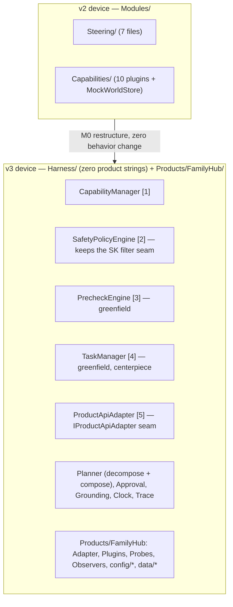
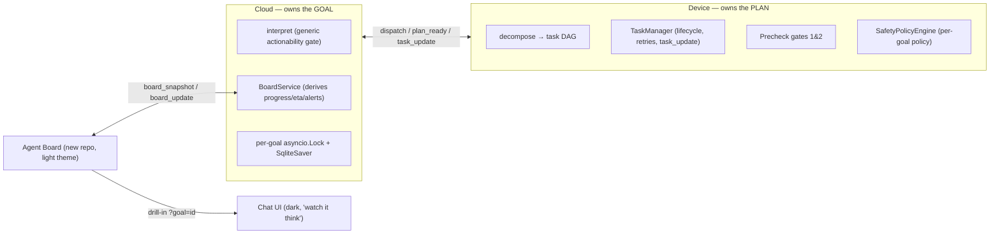

# GoalFlow v3 — Harness + Agent Board (refined plan)

## Context

`goal-flow-agents` is the docs-only, cross-cutting repo; the four code repos live as siblings.
To honor "first check the repo," the three live code repos (`goal-flow-device-agent-ubuntu`,
`goal-flow-cloud-agent`, `goal-flow-agent-chat-ui` — public on `github.com/ashuksingh11`) were
cloned and **every code-anchored claim in the draft was verified**. They all hold (table below).

The durable artifact for this phase is the **v3 design proposal**, landed in `goal-flow-agents`
exactly as `docs/V2_DESIGN_PROPOSAL.md` did for v2. Matches the repo workflow in `AGENTS.md`:
*plan (Opus) → design (Fable) → coding (Codex CLI)*, each phase writing a durable artifact,
confirm before phase jumps. The M0–M9 engineering work is the **roadmap the doc carries**,
executed later in the code repos.

**What v3 delivers (the design):** make the harness *explicit and generic* (five first-class
components), make the agent *multi-goal*, and add **Agent Board** — a new 6th repo, a glanceable
dashboard over every running goal. North star: an impactful demo; scope cut against demo beats.

## Deliverable (the PR in goal-flow-agents)

1. **`docs/V3_DESIGN_PROPOSAL.md`** — architecture, the five components, v2→v3 taxonomy
   reconciliation, multi-goal concurrency, contract-v3 delta, Agent Board, use cases, M0–M9
   roadmap, risks, verification.
2. **`docs/README.md`** — add v3 to index, mark v2 "prior architecture," v1 historical; update the
   banner to point at v3 as current.
3. No code edited here. The doc names exact files/lines in the code repos (verified) so a later
   Codex session executes without re-discovery.

> Optional split: `V3_DESIGN_PROPOSAL.md` + standalone `CONTRACT_V3_DELTA.md`. Default is the
> single proposal doc (v2 precedent, one source of truth).

## Verification of the draft (checked against cloned code — all confirmed)

| Draft claim | Reality in code |
|---|---|
| `PluginType` switch, `CapabilityRegistry.cs:85-98` | Exact — `switch` at 85, 10 plugin types (`_ => null`). |
| 13-function `ReadOnlyPlanningFunctions`, `GoalAgent.cs:975-994` | Exact — 13 `(Module,Function)` tuples, method at 975. |
| `SetPolicy` on singleton, `GoalAgent.cs:230` | Exact — `_safety.SetPolicy(dispatch.Constraints.Hard)`; `SafetyFilter.SetPolicy` at `SafetyFilter.cs:38`. |
| Hardcoded safety checks keyed on `ShoppingList`/`PlaceOrder` | Confirmed — `CheckIngredients`/`CheckBudgetCap`(`PlaceOrder`)/`CheckQuietHours`/`CheckResult` in `SafetyFilter.cs:97-181`; filter is `IFunctionInvocationFilter.OnFunctionInvocationAsync`. |
| `_activeGoals`/`_pendingPatches` plain `Dictionary` | Confirmed — `GoalAgent.cs:49,53`. |
| Trace single `_seq` + pinned goal_id | Confirmed — `Trace.cs:20-21`; scope entry is **`BeginGoalScope`** (draft says "BeginGoal") — resets `_seq=0`, pins `_goalId` (`Trace.cs:35-42`). |
| `MonitorAdapt` `meal_plan`/`guest_dinner` switch | Confirmed — `MonitorAdapt.cs:44-47`; `MaterialityPolicy` at 332. |
| `Program.cs` fans dispatches via `Task.Run` | Confirmed — `Program.cs:127`. |
| Cloud `_canonical_domain` hack; hardcoded domains | Confirmed — `graph/nodes.py:121` (collapses to two, 135-136); `actionable` field 90-108; interpret prompt 281-291; `domain=="meal_plan"` branch 428. |
| Cloud caches capabilities but never feeds the graph | Confirmed — `server.py:131` (`SessionState.capabilities`), `304` (`set_capabilities`); `start_goal(graph, goal_text, goal_id)` at `nodes.py:821` takes no capabilities. |
| Cloud uses `MemorySaver` | Confirmed — default at `nodes.py:791`. No `goal_locks` yet (greenfield). |
| `ws.ts INBOUND_TYPES` silently drops unlisted frames | Confirmed — `ws.ts:28`, gate at 135; 9 listed types. |

**Two corrections to fold in:** (a) the Trace method is `BeginGoalScope`, not `BeginGoal`; (b) the
"five first-class components" taxonomy is **not** in any committed architecture doc — it originates
in the brainstorm (`GoalFlow-discussions/claude/Harness.md`, `claude/final-summary.md`,
`gpt/initial-thought.md`, naming Task manager / Pre-check / Capability manager / Product API
adapters + Safety gate as the "5 existing"). The device repo's `docs/HARNESSES.md` currently
documents the **11** v2 modules. So frame v3 as *promoting/reconciling* those five to first-class,
mapping the 11 onto them — not as "implementing what the arch docs already named."

## The shape of the v3 change

## Architecture — the five first-class components (`Harness/`, zero product strings)

`Modules/` dissolves into a generic `Harness/` core plus `Products/FamilyHub/`. **Invariant:
`Harness/` contains no product literals** — no plugin type names, no `meal_plan`, no ingredient
groups. Everything fridge lives under `Products/FamilyHub/`.

- **[1] Capability Manager** (`Harness/CapabilityManager/`) — kills the `PluginType` switch
  (`CapabilityRegistry.cs:85`), the 13-function whitelist (`GoalAgent.cs:975`), and the hand-written
  tool list in `BuildGroundingInstruction`. `ICapabilityManager`: `All / Resolve / IsAvailable /
  GroundingFunctions(Dispatch) / ProposalTargets(Dispatch) / BuildCapabilitiesMessage`. Descriptors =
  discovery (assembly scan for `*Plugin` + `kernel.Plugins` metadata + `[SideEffect]`) merged with
  `config/policy.json` (grades) + `config/prechecks.json` (probes). **M0 gate: derived grounding set
  == the 13 functions, exactly.**
- **[2] Safety Policy Engine** (`Harness/SafetyPolicyEngine/`) — keep `SafetyFilter :
  IFunctionInvocationFilter` verbatim as the hook; move each check body to declarative **rule kinds**
  in `policy.json` (`blocked_terms`, `numeric_cap`, `time_window_block`, `result_screen`, `prohibit`,
  `actor_authority`), each a 1:1 port of `CheckIngredients`/`CheckBudgetCap`/`CheckQuietHours`/
  `CheckResult`. **Grades unify tiers:** A0=auto, A1=light, A2=firm, **AX=prohibited (new)**; `adapt`
  becomes `origin:"adaptation"` carrying its effect's grade. `[SideEffect]` stays as intrinsic-risk
  fallback; `policy.json` may only make a grade **stricter** — a loosening override **fails loudly at
  load** (safety ratchet). AX enforced twice (never a proposal target; filter blocks unconditionally).
- **[3] Pre-check Engine** (`Harness/PrecheckEngine/`, greenfield) — `IPrecheckProbe` +
  `IPrecheckEngine`, two gates: gate 1 before grounding (fail → `task_status:"waiting"` + remediation →
  board Waiting/At-Risk), gate 2 before actuating (fail → proposal stays Approved-but-not-Executed,
  `result:"deferred_precheck"`). **Not in the SK filter** (filter stays safety-only; blocked-forever vs
  blocked-for-now differ). `config/prechecks.json` binds capability patterns → probe ids; probes read
  `Products/FamilyHub/data/device_state.json` through the adapter.
- **[4] Task Manager** (`Harness/TaskManager/`, greenfield, **centerpiece**) — replaces
  `_activeGoals`/`ActiveGoalContext`/`TaskStatuses`. `TaskState` enum + `TaskRecord` + `ITaskManager`
  (`CreateGoal`, `NextReady`, validated `Transition`, `AttachPlan`). Legal-transition table is code
  (invariant); task content is data. Every `Transition` emits a `task_update` agent_event → **makes
  Agent Board honest** (progress %, next step, ETA, pending, retries are *derived*). `MonitorAdapt`
  moves here; its domain switch becomes registered `IDomainObserver`s from the pack; `MaterialityPolicy`
  stays deterministic.
- **[5] Product API Adapter** (`Harness/ProductApiAdapter/`) — `IProductApiAdapter` extracted from
  `MockWorldStore` (`ReadAsync`/`WriteAsync`/`ResetAsync`/`ResolveOffset`/`OffsetFromToday`/`Clock`).
  All plugins take `IProductApiAdapter`; **internals untouched — fridge functions stay mocked**.
  `MockFamilyHubAdapter` = `MockWorldStore` moved, preserving the no-absolute-dates day-offset invariant.

**Two-altitude planner** (`Harness/Planner/`, extracted from `GoalAgent`): pass 1 `decompose` = JSON-mode
LLM call over the capability registry → task DAG (cap ~8 tasks, cycles dropped in code, **fail-soft to a
single synthesized task = today's behavior**); pass 2 = today's proven grounding+compose per ready task.
Plan items & proposals carry `task_id`.

## Multi-goal concurrency — three real bugs (verified live)

`Program.cs:127` already fans every dispatch via `Task.Run`, so 3 goals **will** run concurrently:
1. **`SetPolicy` clobber** (`GoalAgent.cs:230`, singleton `SafetyFilter`) — goal B overwrites goal A's
   hard constraints mid-plan → **the deterministic gate enforces the wrong allergens.** Worst failure for
   "LLM plans, code checks." **Fix:** policy keyed per goal; current goal flowed to the filter via
   `AsyncLocal<string>` scope set at the top of Run/ApplyApproval/HandleControl. **Must land in M1.**
2. **Trace one `_seq`/one pinned goal_id** (`Trace.cs:20-21`) — `BeginGoalScope` resets seq and re-pins →
   goal A's later events collide under B's id, UI drops them. **Fix:** `BeginGoalScope` returns a
   `TraceScope` with its own seq/ids, held by the goal's context.
3. **`_activeGoals`/`_pendingPatches` plain `Dictionary`** mutated from `Task.Run` threads → torn state.
   **Fix:** `ConcurrentDictionary` + per-goal `SemaphoreSlim` guarding approval-apply vs control-tick.

**Cloud:** `goal_locks: defaultdict(asyncio.Lock)` keyed by `goal_id` around every
`start_goal`/`resume_goal` before the `asyncio.to_thread` hop. **Model:** cross-goal parallel for
monitor/adapt/approval; **device planning capped at 1** (`SemaphoreSlim(1)`) → queued goals surface as
**Waiting** on the board.

## Persistence

- **Cloud:** `MemorySaver`→`SqliteSaver` (`langgraph-checkpoint-sqlite`, one dep) at `data/goalflow.db`,
  plus stdlib-`sqlite3` `board` + `suggestions` tables in the same file. No Redis/ORM.
- **Device:** serialize each goal context to `data/goals/<goal_id>.json` on change; reload at startup.
- **Demo value:** kill the cloud mid-demo, restart, board rehydrates.

## Cloud — generic actionability gate + BoardService

- **Actionability gate:** delete `_canonical_domain` (`nodes.py:121`) and the two hardcoded domains in
  the `actionable` field (90-108) and interpret prompt (281-291). Feed the already-cached capability
  digest (`server.py:131`) into the initial `GraphState`; prompt becomes "set actionable=true iff the
  goal can plausibly be advanced using these advertised functions." **AX functions still make a goal
  actionable** — cloud answers "is this in the product's world?", device Safety Policy Engine answers
  "may it happen?" (the "unlock the door" beat). **Must land before M7.**
- **BoardService** (`src/goalflow_cloud/board.py`, ~250 lines, deterministic, unit-testable) — board
  truth is **cloud-derived** from frames the hub already routes, folded against device `task_update`.
  Field sources: progress_pct = completed/total tasks; next_step = `NextReady` title (unanswered
  adaptation wins; awaiting_approval → "Review & approve"); eta = `time_window.end`; pending_tasks = not
  Completed + approval-required proposals not executed; alerts = open adaptations + safety blocks +
  precheck fails + device offline; state = completed / waiting / at_risk / on_track.

## Contract v3 (additive; canonical `CONTRACT.md` in cloud repo)

Any frame change touches ALL of: `CONTRACT.md`, `contract.py`, both `contract.ts` (chat UI + new board
UI), `Contracts/*.cs`, **and `ws.ts INBOUND_TYPES`** (`ws.ts:28`) — one pass. Frames:
`plan_ready.payload.precheck`; `task_id` on `plan[]`/`proposals[]`; `proposals[].grade` (A0|A1|A2)
alongside kept `tier`; adaptations gain `origin:"adaptation"`; `capabilities` per-function
`grade`+`prechecks`, steering list renamed to v3 components; new agent_event `task_update
{task_id,state,detail}`; `status.executed[].result` gains `"deferred_precheck"`; **board frames**
`board_snapshot`/`board_update`/`board_get`/`goal_state_get`/`goal_accepted`, `user_goal` gains
`client_ref`; **suggestions** `signals` + `suggestion_action`. `GoalSummary` = `{goal_id, client_ref,
title, subtitle, domain, state, task_status, progress_pct, next_step, eta, pending_tasks, alerts, activity[],
updated_at}`; replace-by-id deltas; monotonic `board_seq` (gap → UI sends `board_get`).

## Agent Board — new repo `goal-flow-agent-board`

React 18 + Vite 5 + TS matching the chat UI; **light theme** (chat UI stays dark). Copy-don't-share
`lib/ws.ts` (singleton socket, 1012-eviction, `?device=`+localStorage self-heal) and `types/contract.ts`.
State keyed from day one (`goals: Record<id,GoalSummary>`, `goalOrder`, `boardSeq`, `suggestions`), driven
by `board_snapshot`/`board_update`. Drill-in: card opens `/?goal=<id>` in the chat UI → `goal_state_get`
rehydrates. Bottom nav = inert chrome; only Agent Board is live.

## Use cases (pruned to demo need)

4-goal board lineup: **Meal** (regression canary, exists), **Birthday** (Task Manager: DAG/progress/ETA;
needs FamilyBoard plugin + Budget/Notify/FamilyProfiles stubs implemented), **Vacation** (Pre-check +
AX + retry; needs SmartThings + Security plugins), **Restock** (Safety budget cap + A2; needs Budget +
prices). 3 new plugins (SmartThings folds scenes/thermostat/energy/vacuum; Security; FamilyBoard) +
implement the 3 existing named stubs. Negative paths: AX door, precheck-offline, safety-block-with-recovery,
child-authority (`constraints.hard.actor` + `actor_authority` rule), retry. Proactive: deterministic
`signals` → suggestion cards → tap-`+` spins a 4th goal through the normal pipeline (no unprompted LLM
calls). All mock-world additions offset-relative (no absolute dates).

## Roadmap (M0–M9; demo runnable after each; confirm before phase jumps)

- **Phase A — device harness:** M0 restructure + seams, zero behavior change (delete `PluginType` switch
  & `ReadOnlyPlanningFunctions`, derive by discovery; extract `IProductApiAdapter`) · M1 Safety Policy
  Engine (**includes the per-goal `SetPolicy` fix**) · M2 Task Manager + two-altitude planner · M3
  Pre-check Engine.
- **Phase B — multi-goal + cloud:** M4 generic actionability gate (before M7) · M5 concurrency +
  persistence.
- **Phase C — Agent Board:** M6 contract-v3 board frames + `BoardService` + `goal-flow-agent-board` +
  chat-UI `?goal=` deep-link (parallelizable with Phase B).
- **Phase D — demo:** M7 plugins + use cases · M8 negative paths + proactive suggestions · M9 Tizen
  re-sync (one pass), device `HARNESSES.md` v3 rewrite, demo choreography.

**Cut order if short:** child-authority → suggestions → device persistence → retry. **Never cut:** M0
restructure, M1 policy engine, M2 Task Manager.

## Risks

1. `SetPolicy` clobber is a **live safety bug** — land in M1 before 2-goal submit.
2. Prompt regressions from config-driven prompts — domain fragments start as **verbatim** copies; diff
   sim outputs before any wording change.
3. Tizen byte-copy recipe names `Modules/` (disappears in M0) — one re-sync at M9 (mechanical, don't forget).
4. Two-altitude planner cost/latency — cap task count, validate DAG in code, fail-soft to single task.
5. Scope creep toward a 13-component TDS — resist; extra components map onto existing modules. No empty folders.

## Verification

- **Regression canary, every milestone:** `--simulate-week` + `--simulate-guest` byte-identical.
- **M0 gate:** derived grounding set == the 13 functions; sim output byte-identical.
- **Concurrency:** submit 3 goals with different hard constraints; each block cites its own constraints;
  no `agent_event` seq collides across goals.
- **Persistence:** kill cloud at `awaiting_approval`; restart; board rehydrates, approval resumes.
- **Safety ratchet:** a `policy.json` entry loosening A2→A1 fails loudly at load.
- **End-to-end (browser):** cloud+device+chat UI+board; board counts match goal states; fire
  `thermostat-fault` → Vacation flips At Risk; approve restock → Waiting → On Track.
